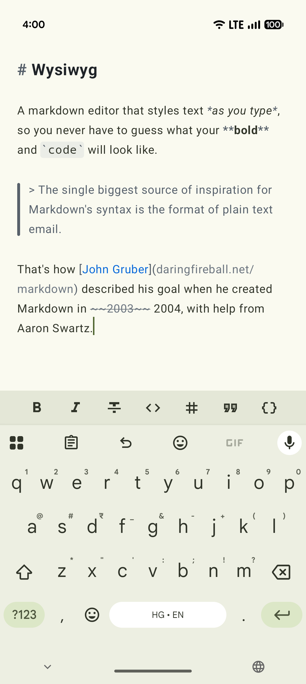
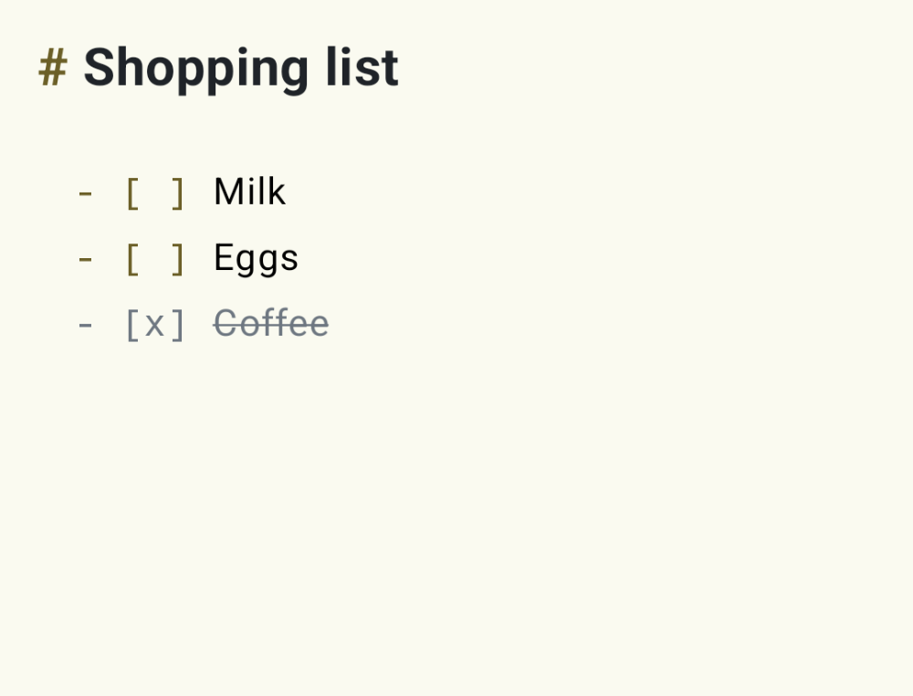
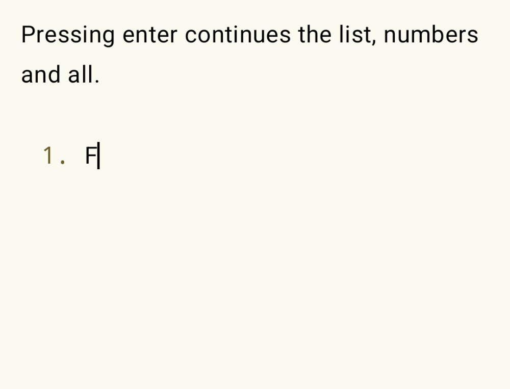
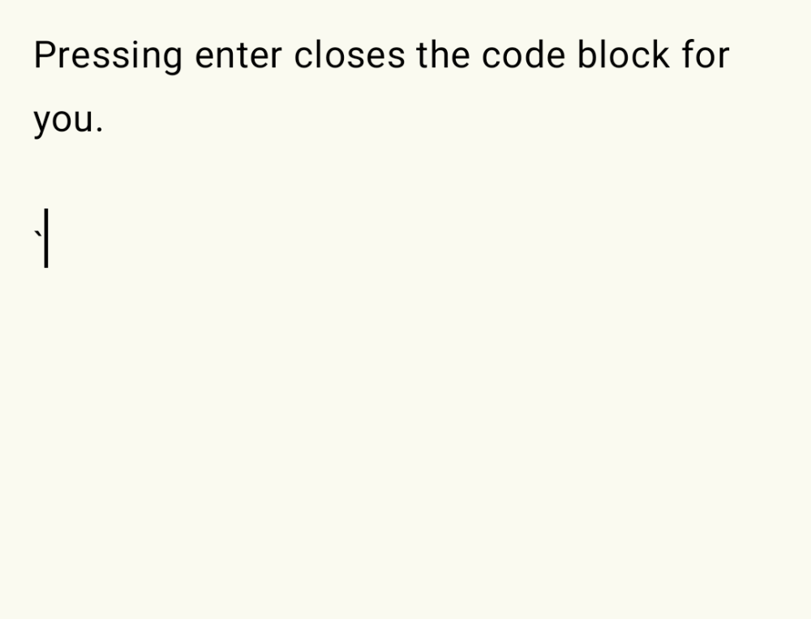

# Wysiwyg



An **experimental** markdown editor for Compose UI that styles markdown syntax in real time. Edits are applied incrementally on every keystroke for instant feedback, while the full re-parse runs off the main thread. Uses [flexmark](https://github.com/vsch/flexmark-java/) by default, but can be replaced with any other parser.

### Usage

```groovy
TODO: upload to maven
```

```kotlin
WysiwygTextField(
  wysiwyg = rememberWysiwyg(
    textState = rememberTextFieldState(),
  ),
  theme = WysiwygTheme.Github,
  contentPadding = PaddingValues(16.dp),
)
```

### Supported features

#### Markdown elements

| Element           | Example                              |
|-------------------|--------------------------------------|
| Headings          | `# Heading` through `###### Heading` |
| Bold              | `**bold**`                           |
| Italic            | `*italic*`                           |
| Strikethrough     | `~~strikethrough~~`                  |
| Inline code       | `` `code` ``                         |
| Fenced code block | triple backticks                     |
| Block quote       | `> quote`                            |
| Ordered list      | `1. item`                            |
| Unordered list    | `- item`                             |
| Task list         | `- [ ] item`                         |
| Link              | `[text](url)`                        |
| Thematic break    | `---`                                |

#### Interactive checkboxes



#### Auto-format on enter

| List continuation                                                                                                                   | Code blocks                                                                                                                       |
|-------------------------------------------------------------------------------------------------------------------------------------|-----------------------------------------------------------------------------------------------------------------------------------|
|  |  | 

TODO: document
- Formatting actions
- Customization
  - Theme
  - Markdown parser

### Limitations

- Wysiwyg uses `BasicTextField()` internally, which can't handle large documents. In my limited testing, editing a document with 50k characters drops enough frames to feel sluggish, even on my flagship Pixel 10 Pro.

### Road to stability

This library is experimental and the API may change. A couple of upstream Compose changes need to land first:

- Editing plain paragraphs still feels rough, pending [b/241426911](https://issuetracker.google.com/issues/241426911).
- Styling will move to `TextStyleBuffer` once it [lands in Compose](https://android-review.googlesource.com/c/platform/frameworks/support/+/3968187), replacing the current full re-parse.

### License

```
Copyright 2026 Saket Narayan.

Licensed under the Apache License, Version 2.0 (the "License");
you may not use this file except in compliance with the License.
You may obtain a copy of the License at

   http://www.apache.org/licenses/LICENSE-2.0

Unless required by applicable law or agreed to in writing, software
distributed under the License is distributed on an "AS IS" BASIS,
WITHOUT WARRANTIES OR CONDITIONS OF ANY KIND, either express or implied.
See the License for the specific language governing permissions and
limitations under the License.
```
